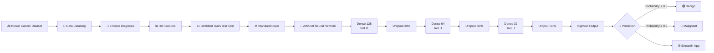
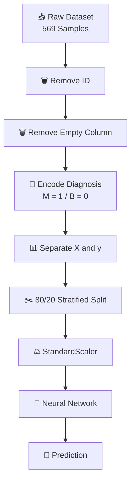
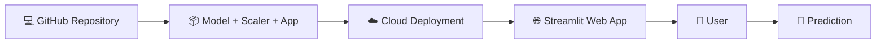

# 🩺 Breast Cancer Prediction using Deep Learning

<p align="center">


</p>

<p align="center">
  <b>🧠 An Artificial Neural Network for Breast Tumor Classification</b>
  <br>
  <sub>Built with TensorFlow • Scikit-learn • Streamlit</sub>
</p>

<p align="center">

<a href="#-overview">📖 Overview</a> • <a href="#-architecture">🧠 Architecture</a> • <a href="#-results">📊 Results</a> • <a href="#-installation">⚙️ Installation</a> • <a href="#-deployment">🚀 Deployment</a>

</p>

---

## 🎯 Overview

**Breast Cancer Prediction** is an end-to-end Deep Learning project that uses clinical diagnostic measurements to classify breast tumors into:

> 🟢 **Benign**
> 🔴 **Malignant**

The project combines a **fully connected Artificial Neural Network**, feature standardization, model evaluation, and a **Streamlit interactive application**.

The trained neural network achieved **98.25% accuracy on the held-out test set** in the notebook.

---

## ✨ Project Highlights

<table>
<tr>
<td align="center">🧠<br><b>Deep Learning</b><br><sub>ANN classifier</sub></td>
<td align="center">📊<br><b>30 Features</b><br><sub>Diagnostic measurements</sub></td>
<td align="center">🎯<br><b>98.25%</b><br><sub>Test Accuracy</sub></td>
<td align="center">🌐<br><b>Streamlit</b><br><sub>Interactive App</sub></td>
</tr>
</table>

### 🔥 Key Features

* 🧠 Artificial Neural Network built with TensorFlow/Keras
* 📊 30 numerical diagnostic features
* ⚖️ StandardScaler preprocessing
* ✂️ Stratified 80/20 train-test split
* 🛡️ Dropout regularization
* ⚡ Adam optimizer
* 🎯 Binary cross-entropy loss
* 📈 Training and validation monitoring
* 🔮 Probability-based classification
* 🌐 Interactive Streamlit interface
* 💾 Saved model and preprocessing pipeline

---

# 🔬 How It Works



---

# 🧠 Model Architecture

The neural network contains **14,337 trainable parameters**.

```text
                    INPUT
               30 Diagnostic Features
                       │
                       ▼
              ┌─────────────────┐
              │ Dense Layer     │
              │ 128 Neurons     │
              │ ReLU            │
              └────────┬────────┘
                       │
                       ▼
                 Dropout 30%
                       │
                       ▼
              ┌─────────────────┐
              │ Dense Layer     │
              │ 64 Neurons      │
              │ ReLU            │
              └────────┬────────┘
                       │
                       ▼
                 Dropout 30%
                       │
                       ▼
              ┌─────────────────┐
              │ Dense Layer     │
              │ 32 Neurons      │
              │ ReLU            │
              └────────┬────────┘
                       │
                       ▼
                 Dropout 30%
                       │
                       ▼
              ┌─────────────────┐
              │ Output Layer    │
              │ 1 Neuron        │
              │ Sigmoid         │
              └────────┬────────┘
                       │
                       ▼
              🟢 Benign / 🔴 Malignant
```

### ⚙️ Architecture Details

| Component            | Configuration |
| -------------------- | ------------: |
| Input Features       |            30 |
| Dense Layer 1        |   128 neurons |
| Activation           |          ReLU |
| Dropout              |           30% |
| Dense Layer 2        |    64 neurons |
| Activation           |          ReLU |
| Dropout              |           30% |
| Dense Layer 3        |    32 neurons |
| Activation           |          ReLU |
| Dropout              |           30% |
| Output               |      1 neuron |
| Output Activation    |       Sigmoid |
| Trainable Parameters |        14,337 |

The architecture and parameter counts come directly from the notebook's Keras model summary.

---

# 📊 Dataset

The dataset contains **569 observations and 33 original columns**. After removing the `id` and empty `Unnamed: 32` columns, the model uses **30 numerical features plus the encoded diagnosis target**.

### 🎯 Target Encoding

```text
M → 1 → 🔴 Malignant

B → 0 → 🟢 Benign
```

### 📐 Feature Groups

The diagnostic measurements include:

* Radius
* Texture
* Perimeter
* Area
* Smoothness
* Compactness
* Concavity
* Concave Points
* Symmetry
* Fractal Dimension

These measurements are provided as:

```text
Mean Features
      +
Standard Error Features
      +
Worst Features
```

---

# ⚙️ Data Preprocessing

The preprocessing pipeline is designed to keep training and inference consistent.



The notebook uses an **80/20 stratified split**, producing **455 training samples and 114 test samples**, followed by `StandardScaler`.

---

# 🏋️ Training Configuration

| Parameter           | Value                |
| ------------------- | -------------------- |
| 🧠 Framework        | TensorFlow / Keras   |
| ⚡ Optimizer         | Adam                 |
| 📉 Loss             | Binary Cross-Entropy |
| 🎯 Metric           | Accuracy             |
| 🔄 Epochs           | 50                   |
| 📦 Batch Size       | 32                   |
| ✂️ Validation Split | 20%                  |
| ⚖️ Scaling          | StandardScaler       |

These training settings are implemented in the notebook.

---

# 📈 Results

### 🏆 Test Performance

| Metric                  |     Result |
| ----------------------- | ---------: |
| 🎯 Test Accuracy        | **98.25%** |
| 📉 Test Loss            | **0.1120** |
| 🧠 Trainable Parameters | **14,337** |

The final notebook evaluation reports a test loss of **0.1120** and test accuracy of **0.9825**.

### 📊 Training Snapshot

By the final epoch, the training accuracy reached **100%**, while validation accuracy was **96.70%**. The best validation accuracy visible in the training log reached **98.90% at epoch 47**.

> 💡 Because this is a medical classification project, accuracy alone should not be treated as sufficient evidence for real-world clinical performance.

---

# 🌐 Streamlit Application

The trained model is integrated into an interactive **Streamlit application**.

```text
                 👤 USER
                   │
                   ▼
        ┌─────────────────────┐
        │ Patient Data Input  │
        │      🎚️ Sliders     │
        └──────────┬──────────┘
                   │
                   ▼
             ⚖️ Scaling
                   │
                   ▼
          🧠 Trained ANN Model
                   │
                   ▼
             🔮 Probability
                   │
                   ▼
            ┌──────┴──────┐
            │             │
            ▼             ▼
       🟢 BENIGN     🔴 MALIGNANT
```

The notebook's Streamlit implementation loads the saved scaler and model, provides feature sliders, scales the entered values, and generates a prediction using a **0.5 probability threshold**.

---

# 🖥️ Application Features

### 👤 Input

Users can enter the diagnostic measurements through interactive sliders.

### ⚖️ Automatic Preprocessing

The same trained `StandardScaler` is applied to user inputs.

### 🧠 AI Prediction

The trained neural network generates a probability.

### 📊 Result

```text
Probability < 0.5
        ↓
🟢 Benign

Probability ≥ 0.5
        ↓
🔴 Malignant
```

---

# 📁 Project Structure

```text
Breast-Cancer-Deep-Learning/
│
├── 📓 Brest_Cancer.ipynb
│
├── 🧠 breast_cancer_model.h5
│
├── ⚖️ scaler.pkl
│
├── 📊 feature_stats.pkl
│
├── 🌐 app.py
│
├── 📄 requirements.txt
│
└── 📖 README.md
```

The notebook saves the trained model as `breast_cancer_model.h5`, the scaler as `scaler.pkl`, and feature statistics as `feature_stats.pkl`.

---

# 🛠️ Tech Stack

<p align="center">


</p>

| Technology      | Role                            |
| --------------- | ------------------------------- |
| 🐍 Python       | Core programming                |
| 🧠 TensorFlow   | Deep Learning framework         |
| 🔥 Keras        | Neural Network development      |
| 📊 Pandas       | Data manipulation               |
| 🔢 NumPy        | Numerical computation           |
| 📈 Scikit-learn | Preprocessing & splitting       |
| 🌐 Streamlit    | Interactive web application     |
| 💾 Joblib       | Model preprocessing persistence |
| 📓 Google Colab | Development environment         |

---

# ⚡ Installation

### 1️⃣ Clone the Repository

```bash
git clone https://github.com/YOUR_USERNAME/YOUR_REPOSITORY.git
cd YOUR_REPOSITORY
```

### 2️⃣ Install Dependencies

```bash
pip install tensorflow pandas numpy scikit-learn joblib streamlit
```

### 3️⃣ Run the Application

```bash
streamlit run app.py
```

### 4️⃣ Open in Browser

```text
http://localhost:8501
```

---

# 🚀 Deployment

You can deploy the Streamlit application using platforms that support Streamlit applications.

### Deployment Flow



---

# 🔮 Future Roadmap

* [ ] 📊 Add confusion matrix
* [ ] 📈 Add precision, recall and F1-score
* [ ] 📉 Add ROC-AUC analysis
* [ ] 🔍 Add SHAP explainability
* [ ] 🧪 Add cross-validation
* [ ] ⚙️ Hyperparameter optimization
* [ ] 📊 Add interactive prediction probability charts
* [ ] 🎨 Improve Streamlit UI
* [ ] 🐳 Add Docker support
* [ ] 🔄 Create REST API
* [ ] ☁️ Deploy production-ready application
* [ ] 🧠 Experiment with additional model architectures

---

# 🔐 Responsible AI & Medical Disclaimer

This project is intended **strictly for educational and research purposes**.

It should **not** be used as a medical diagnostic tool or as a replacement for qualified healthcare professionals.

The model's predictions are based on the dataset and training procedure used in this project and should not be interpreted as clinical advice.

> 🩺 **Always consult a qualified healthcare professional for medical diagnosis and treatment decisions.**

---

# 👨‍💻 Author

## **Aravind**

🎓 Student | 🧠 AI & Deep Learning Enthusiast | 💻 Developer

Focused on building practical AI systems and converting machine learning concepts into usable applications.

---

# ⭐ Support the Project

If you found this project useful:

<p align="center">

<a href="https://github.com/YOUR_USERNAME/YOUR_REPOSITORY">

</a>

<a href="https://github.com/YOUR_USERNAME/YOUR_REPOSITORY/fork">

</a>

<a href="https://github.com/YOUR_USERNAME/YOUR_REPOSITORY/issues">

</a>

</p>

---

<p align="center">

### 🧠 Built with Deep Learning

### 🚀 From Dataset → Neural Network → Web Application

**If you like the project, don't forget to ⭐ the repository!**

</p>
